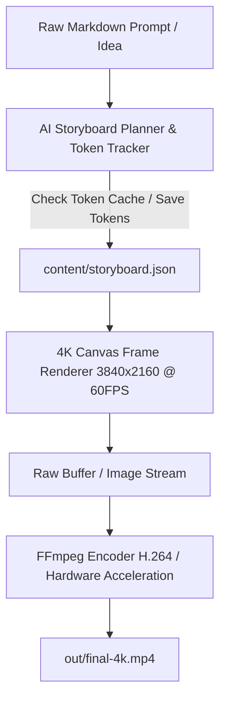

# DB 4K Headless Video Engine — Master Implementation & Architecture Guide

Welcome to the technical implementation documentation for **DB Video Editor**, a high-performance, local-first 4K headless video generation engine built in Node.js and TypeScript using `@napi-rs/canvas` and `fluent-ffmpeg`.

---

## 1. Core Architecture & Pipeline

The rendering engine operates on a zero-browser footprint architecture:
- **Canvas Rendering**: Uses `@napi-rs/canvas` (Rust-backed HTML5 Canvas API bindings for Node.js) running strictly at 4K UHD resolution (**3840x2160**) and **60 FPS**.
- **Frame-by-Frame Streaming**: Sequential canvas frames are rendered and streamed directly into FFmpeg stdin/tmp pipe, eliminating disk I/O bottlenecks.
- **Hardware Acceleration**: FFmpeg is configured with high-performance H.264 encoding flags (`-c:v libx264 -pix_fmt yuv420p -crf 18 -preset medium -movflags +faststart`).

---

## 2. Storyboard Architecture & JSON Schema

Videos are driven by structured storyboards ([`content/storyboard-schema.json`](file:///C:/db-video-editor/content/storyboard-schema.json)).

### Storyboard JSON Anatomy

\`\`\`json
{
  "title": "4K Product Demo",
  "width": 3840,
  "height": 2160,
  "fps": 60,
  "output": "out/product-demo-4k.mp4",
  "scenes": [
    {
      "sceneNumber": 1,
      "durationInSeconds": 4,
      "theme": {
        "backgroundColor": "#090d16",
        "accentColor": "#38bdf8",
        "textColor": "#ffffff"
      },
      "textOverlays": [
        {
          "text": "Local 4K Headless Engine",
          "fontSize": 72,
          "x": 1920,
          "y": 1080,
          "align": "center",
          "animation": "fadeIn"
        }
      ],
      "mediaAssets": [
        { "path": "assets/tech-bg.png", "opacity": 0.3 }
      ],
      "audio": [
        { "path": "assets/audio/bed.mp3", "startAt": 0, "volume": 0.8 }
      ]
    }
  ]
}
\`\`\`

---

## 3. AI Token Usage Monitoring & Savings Engine

To save AI tokens and eliminate redundant LLM computation during video script creation, the engine includes an **AI Token Tracker & Caching Engine** ([`core/tokens.ts`](file:///C:/db-video-editor/core/tokens.ts)).

### Key Token Optimization Features:
1. **Prompt SHA-256 Hashing**: Input markdown briefs are hashed. If a prompt has already been synthesized, the planner reuses the cached storyboard JSON, saving **100% of LLM tokens**.
2. **Token Usage Logging**: Keeps track of prompt tokens, completion tokens, estimated cost, and cumulative tokens saved in `content/token-usage-log.json`.
3. **CLI Token Stats**: View total tokens used and saved via `node cli.ts tokens`.

---

## 4. CLI Command Reference

| Command | Syntax | Description |
| :--- | :--- | :--- |
| `init` | `node cli.ts init --name "My Project"` | Scaffold directories & generate `TUTORIAL.md` |
| `plan` | `node cli.ts plan --input content/brief.md` | Synthesize storyboard JSON with token tracking |
| `render` | `node cli.ts render --storyboard content/storyboard.json` | Render 4K video from storyboard |
| `tokens` | `node cli.ts tokens` | Display AI token usage & savings report |
| `validate` | `node cli.ts validate` | Scan & validate local media asset manifest |
| `list` | `node cli.ts list` | List available compositions |

---

## 5. Animation Math & Interpolation

All scene property animations use stateless pure math helpers in [`core/easing.ts`](file:///C:/db-video-editor/core/easing.ts):
- `lerp(a, b, t)`: Linear interpolation
- `progress(t, start, end)`: Normalized 0..1 progress window
- Easing functions: `easeInOutCubic`, `easeOutQuad`, `easeOutBounce`, `easeOutBack`
