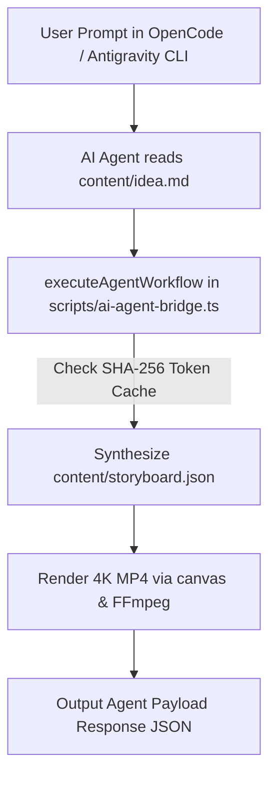

# DB Video Engine — Comprehensive User & Creator Manual

Welcome to **DB Video Editor**, a high-performance, local-first 4K headless video generation engine powered by Node.js, TypeScript, Canvas, and FFmpeg.

This guide explains step-by-step how creators and AI tools (such as **OpenCode CLI**, **Claude Code**, or **Antigravity CLI**) use the system to build, configure, and render video content across multiple resolutions and quality presets.

---

## 🤖 AI Assistant Integration Workflow (OpenCode CLI / Claude Code / Antigravity CLI)

AI coding tools can control the video engine directly via TypeScript/JSON payloads in standard workspace mode, bypassing manual command-line typing.



### 1. Zero-CLI Programmatic Agent Execution
AI tools call `executeAgentWorkflow()` in [`scripts/ai-agent-bridge.ts`](file:///C:/db-video-editor/scripts/ai-agent-bridge.ts):

```typescript
import { executeAgentWorkflow } from './scripts/ai-agent-bridge.ts';

const response = await executeAgentWorkflow({
  promptText: "# Product Launch Promo\n## Scene 1: Next-gen Video AI",
  resolution: "4k",
  quality: "high",
});

console.log(response.outputVideoPath); // out/agent-render-4k.mp4
```

### 2. JSON Request Payload Execution
Agents can drop a request payload (`content/agent-request.json`) into `content/`:

```json
{
  "promptPath": "content/promo-idea-1.md",
  "resolution": "1080p",
  "quality": "standard",
  "outputFile": "out/agent-output.mp4"
}
```

And trigger execution:
```bash
npm run agent content/agent-request.json
```

---

## 🚀 Quickstart & Complete Workflow

### 1. Initialize Workspace Scaffolding

First time in a directory? Run the initialization command to construct the required folders and asset manifest:

```bash
# Terminal command:
node cli.ts init --name "My Project"

# Or via npm shortcut:
npm run init
```

This programmatically creates:
- `assets/images/` — Drop logos, background images, and overlays here.
- `assets/audio/` — Drop background tracks, sound effects, and voiceovers here.
- `assets/fonts/` — Drop custom TTF/OTF typography here.
- `content/` — Drop raw markdown briefs and generated storyboard JSON files here.
- `out/` — Final rendered MP4 files output folder.

---

### 2. Organize Media Assets & Validate

Drop your media files into the subfolders in `assets/`:

- **Images**: `.png`, `.jpg`, `.jpeg`, `.webp`, `.svg` -> `assets/images/`
- **Audio**: `.mp3`, `.wav`, `.aac`, `.flac` -> `assets/audio/`
- **Fonts**: `.ttf`, `.otf`, `.woff2` -> `assets/fonts/`

Check that your assets are detected cleanly:

```bash
node cli.ts validate
```

---

### 3. Generate AI Storyboard Blueprint (`npm run plan`)

Write a brief markdown script or outline inside `content/promo-idea-1.md`:

```markdown
# Product Launch Promo

## Scene 1: Introduction
Tagline: Powerful local-first video generation.

## Scene 2: High Performance Engine
Frame-accurate rendering in Node.js and Canvas.

## Scene 3: Final Call to Action
Rendered in native 4K UHD @ 60 FPS.
```

Run the AI planner to synthesize a structured JSON blueprint (`content/storyboard.json`):

```bash
node cli.ts plan --input content/promo-idea-1.md --output content/storyboard.json
# or:
npm run plan
```

> 💡 **AI Token Optimization**: The engine hashes input briefs using SHA-256. If you re-run `plan` on an unchanged prompt, the system reuses the cached storyboard, saving **100% of LLM tokens**.

---

### 4. Render Video at Custom Resolution & Quality

Render your storyboard to MP4 video using flexible resolution and quality flags:

```bash
node cli.ts render --storyboard content/storyboard.json --resolution 1080p --quality standard
```

---

## 🎛️ Resolution & Quality Settings Reference

### Target Resolutions (`--resolution`)

| Flag | Resolution | Aspect Ratio | Use Case |
| :--- | :--- | :--- | :--- |
| `720p` | 1280 x 720 | 16:9 | Fast draft previews |
| `1080p` | 1920 x 1080 | 16:9 | Full HD web & social media |
| `1440p` | 2560 x 1440 | 16:9 | Quad HD displays |
| `4k` | 3840 x 2160 | 16:9 | Ultra HD (Production Default) |

### Quality Presets (`--quality`)

| Preset | CRF Value | FFmpeg Preset | Render Speed | Description |
| :--- | :--- | :--- | :--- | :--- |
| `draft` | 28 | `ultrafast` | 🚀 Ultra Fast | Maximum render speed for quick layout checks |
| `standard` | 23 | `fast` | ⚡ Fast | Balanced speed and file size |
| `high` | 18 | `medium` | 🎬 Production | High quality default |
| `ultra` | 14 | `slow` | 💎 Master | Maximum visual fidelity |

---

## 📊 Monitoring AI Token Usage

View AI token consumption and savings at any time:

```bash
node cli.ts tokens
# or:
npm run tokens
```

**Example Report Output**:
```
=== AI Token Usage & Optimization Report ===
Total Planning Runs : 2
Total Prompt Tokens : 89
Total Compl. Tokens : 549
Total Tokens Used   : 638
Total Tokens Saved  : 638 (via prompt caching)
```

---

## 💻 Summary CLI & Agent Cheatsheet

```bash
npm run agent content/promo-idea-1.md                       # AI Agent Direct Bridge Run
npm run init                                                # Scaffold workspace
npm run plan -- --input content/idea.md                     # Generate Storyboard JSON
npm run tokens                                              # Display AI Token Stats
npm run render:storyboard                                   # Default 4K render
npm run cli -- render --storyboard content/storyboard.json --resolution 720p --quality draft   # 720p fast draft
npm run validate                                            # Audit local media manifest
```
